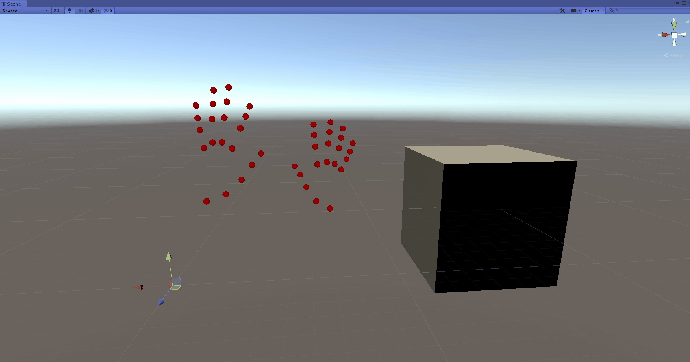

# Unity Hand Tracking with Mediapipe
This is a demo of realtime hand tracking and finger tracking in Unity using Mediapipe.

The tracking section is built on Android but a similar approach should also be applicable for desktop or IOS.

It works by first detecting the hand landmarks by Mediapipe in Android, and then sending the results to PC via adb and protobuf, and finally interpreting the results in PC Unity.

## Prerequisites
* Windows 10 PC recommended
* Android mobile device (recommended with Android version 8.0 or above)
* Unity with Android Build Support and Android SDK & NDK Tools (recommended with version 2019.4.6f1 or 2019.4.x)

## Installation
1. Enable Android Developer Mode and USB debugging in the mobile device. Connect the device with PC and allow permissions.

2. Install the "UnityHandTracking.apk" to the device: 
`adb install UnityHandTracking.apk`
The .apk is included in release. The source code of the apk is available in [mediapipe_multi_hands_tracking_aar_unity](https://github.com/TesseraktZero/mediapipe_multi_hands_tracking_aar_unity).

4. Start and run the SampleScene in Unity project. This should automatically start the Android app and receive data from it.
   
5. Hold the device vertically and capture both hands for best tracking.

## Customization
To apply hand tracking on your own avatar, follow the below steps:

1. Setup `Animtaion Rigging` on the model:
   - Add Prefab `HandLandmarkAndRigs` as child of the model. Add component `Rig Builder` to the model. In the `Rig Layers` of `Rig Builder`, add the four rigs located under `HandLandmarkAndRigs/Rigs` (`LeftHandRig`, `LeftFingerRig`, `RightHandRig`, `RightFingerRig`).
   - In the four Hand Rigs, reassign the `Root` and `Tip` bones based on your model armature. Refer to the sample scene for details.
   - For each of the Hand Rigs, align their transform with the `Tip` transform. To do so, select that object and hold control select object assign in `Tip`. Then, navigate to menu: `Animation Rigging` -> `Align Transform`

2. Adjust the position and rotation of the prefab `HandLandmarkSet` to fit with the model.
   
3. Update the `Adb Path` in `LandmarkSocketManager` of `HandLandmarkSet`. The path should have patterns similar to one of the belows:

   - `C:\Unity\2019.4.6f1\Editor\Data\PlaybackEngines\AndroidPlayer\SDK\platform-tools\adb.exe`

   - `C:\Users\user\AppData\Local\Android\Sdk\platform-tools\adb.exe`

## License

This project is under `Apache License 2.0`.

Third party assets used in this project are under their own licenses which can be found in corresponding asset folders.
